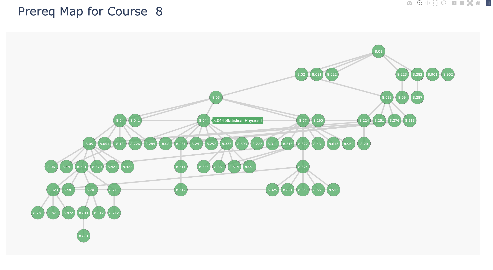

## **Creating Graphs for MIT Classes**

In this project I created dependency graphs for the classes in the majors at MIT, like the one shown below for MIT's Physics Major

These graphs are stored as HTML files, and when users hover over a bubble they can see the full class name for the course number. When users click on a class, a new tab with the full class description opens.

You can view it on the web [here](https://www.subhashk.com/class-visualizer/catalog.html) 

I utilized the Plotly and iGraph Python libraries extensively for this project.

Hope you enjoy!

     
*Further details about the graphs:*

*Some simplifications were made to this model. Some classes in a major depend on classes outside of that major, and those dependencies were ignored for visual simplicity. For example, the dependency of 8.04 Quantum Physics I (a physics course) on 18.03 Differential Equations (a math course) was not shown. Also, some more advanced classes only require "permission of instructor." Those classes were also ignored because they have no implementable dependency.*

*The graphs vary in aesthetics. For some majors, almost all of the classes have no prereqs or only require instructor permission. I completely excluded Course 21 for this reason, as it's graph was essentially empty. I also didn't include Course 3: Materials Science, since many of its listed classes have prereqs that don't exist. Some majors have so many classes that the graphs can be hard to read without zooming (e.g. Course 6, 18). Other majors don't have a central introductory course (e.g. Courses 11, 12) so their graphs are less unified.*

